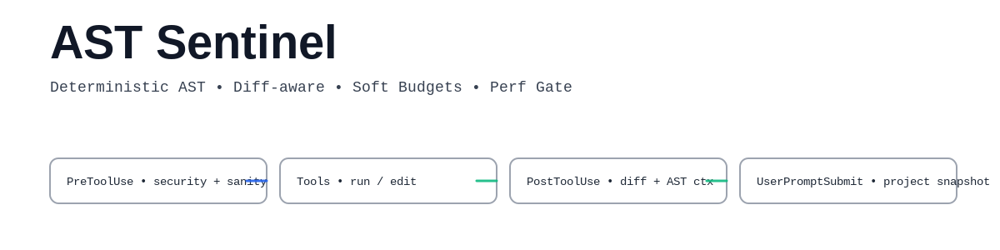
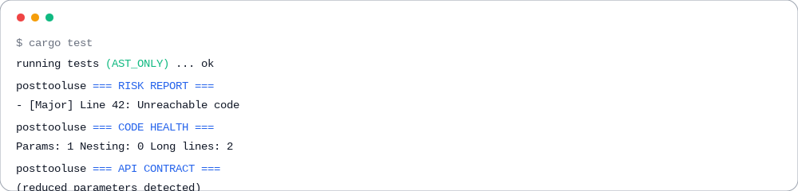

<p align="center">
  
</p>

<p align="center">
  <a href=".github/workflows/ci.yml"></a>
  <a href="#features"></a>
  <a href="#configuration-flags"></a>
  <a href="#testing"></a>
</p>

<p align="center">
  
</p>

<p align="center">
High‑performance validation hooks for Claude Code: deterministic AST checks, diff‑aware context, soft budgets, perf‑gated, and release‑ready.
</p>

## Features

- 🛡️ Security validation: SQL/command/path injection, hardcoded credentials, unsafe patterns
- ✨ Code‑quality analysis: Too‑many‑params, deep‑nesting, complexity, long lines, unreachable, naming/docs
- 🧠 Deterministic AST scoring: stable sorting + caps; diff‑aware entity snippets for context
- ⚡ Performance/observability: soft budgets (size/lines), per‑label timings (p50/p95/p99/avg), strict perf‑gate in CI
- 🧰 Duplicate/Deps insights: duplicate report (caps, per‑type summary, top directories), dependency summary (npm/pip/cargo/poetry)
- 🤖 Multi‑provider AI: OpenAI / Anthropic / xAI / Google (through a unified client) — optional for online mode

## Quick Start

<p align="center">
  
</p>

### 1) Clone and Build

```bash
git clone https://github.com/yourusername/ast-sentinel.git
cd ast-sentinel
cargo build --release
```

### 2) Configure API Keys (for online mode)

**IMPORTANT:** The hooks WILL NOT WORK without real API keys!

```bash
# For development: use .env.local (gitignored)
cp hooks/.env.example hooks/.env.local
nano hooks/.env.local  # Add your REAL API keys here

# OR for production: use .env
cp hooks/.env.example hooks/.env
nano hooks/.env  # Add your REAL API keys here
```

Online mode requires valid provider keys. For offline validation and tests, keys не требуются.

### 3) Install Hooks

Copy the compiled binaries to your hooks directory:

```bash
cp target/release/pretooluse.exe hooks/
cp target/release/posttooluse.exe hooks/
```

### 4) Configure Claude Code

Add to your Claude Code settings to use the validation hooks.

## Configuration (Flags)

### Environment Variables

- `PRETOOL_PROVIDER`: AI provider for pre-validation (openai/xai/anthropic/google)
- `POSTTOOL_PROVIDER`: AI provider for post-validation
- `PRETOOL_MODEL`: Model to use (e.g., gpt-4, grok-code-fast-1)
- `POSTTOOL_MODEL`: Model for post-validation
- `OPENAI_API_KEY`: Your OpenAI API key
- `XAI_API_KEY`: Your xAI API key

Полный справочник флагов и примеров — в <a href="README_HOOKS.md">README_HOOKS.md</a> (Flag Reference, Sections vs. Flags, Windows Quick Start).

### Prompt Customization

Edit prompts in the `prompts/` directory:
- `edit_validation.txt`: Pre-execution validation rules
- `post_edit_validation.txt`: Post-execution quality checks
- `language_instruction.txt`: Language detection rules
- `json_template.txt`: Response format template

## Architecture

```
ast-sentinel/
├── src/
│   ├── bin/
│   │   ├── pretooluse.rs     # Pre-execution validation (anti-cheating, security heuristics)
│   │   └── posttooluse.rs    # Post-execution validation (deterministic AST context)
│   ├── analysis/              # AST, metrics, duplicates, deps, project scan/cache
│   ├── providers/             # AI provider integrations (optional online)
│   └── validation/            # Diff formatter and helpers
├── hooks/                     # Production drop-in (gitignored)
│   └── prompts/               # Production prompts (if used)
└── prompts/                   # Development prompts
```

See also:
- docs/ARCHITECTURE.md — detailed architecture
- docs/PROJECT_STRUCTURE.md — project layout and modules


## Development

### Running Tests

```bash
cargo test
```

Fastpath AST engine is enabled by default. To exercise both paths:
- Fastpath: `cargo test --features ast_fastpath`
- Legacy multipass: `cargo test --no-default-features`

Coverage (Linux/CI parity):
- tarpaulin: `cargo tarpaulin --features ast_fastpath --timeout 120 --out Html`


### Building for Release

```bash
cargo build --release
```

### Release Process

Releases публикуются автоматически через GitHub Actions при пуше тега вида `vX.Y.Z`.

1) Обновите версию в `Cargo.toml` (поле `version`).
2) Создайте тег и запушьте:
```bash
git tag v0.2.0
git push origin v0.2.0
```
3) В разделе Releases появится релиз с артефактами:
   - Windows: `windows-x86_64.zip` (pretooluse.exe, posttooluse.exe, userpromptsubmit.exe, SHA256SUMS.txt)
   - Linux: `linux-x86_64.tar.gz` (pretooluse, posttooluse, userpromptsubmit, SHA256SUMS.txt)

Ручной запуск также доступен через `workflow_dispatch` у workflow `release`.

### Syncing Prompts

```bash
./sync_prompts.sh
```

## Security Best Practices

1. **Never commit API keys** - Use `.env.local` for local development
2. **Rotate keys regularly** - Update API keys periodically
3. **Use restricted keys** - Create keys with minimal required permissions
4. **Review hook feedback** - Pay attention to security warnings

## Troubleshooting

### "API key not found"
- Check that `.env` file exists and contains valid keys
- Verify environment variables are set correctly

### "Model does not exist"
- Ensure you're using a valid model name (e.g., `gpt-4` instead of `gpt-4-turbo`)
- Check API access permissions for the model

### Hook not triggering
- Verify binaries are in the correct location
- Check Claude Code settings for hook configuration
- Review stderr output for error messages

## Windows Path Handling

- Hooks validate and normalize paths cross‑platform. On Windows, backslash and UNC paths are supported.
- Gitignore matching is separator‑agnostic (internally `\\` → `/`).
- Dangerous blanket bans on substrings like `..`, `~`, `$` are removed; canonicalization and allowed directories checks enforce safety.
- On non‑Windows, only the `~/` prefix is rejected; other `~` usages are allowed.

Details: README_HOOKS.md → Windows section.

## Docs
- Architecture: docs/ARCHITECTURE.md
- Project Structure: docs/PROJECT_STRUCTURE.md
- Testing & Coverage: docs/TESTING.md
- Hooks details: README_HOOKS.md

## Contributing

1. Fork the repository
2. Create your feature branch (`git checkout -b feature/amazing-feature`)
3. Commit your changes (`git commit -m 'Add amazing feature'`)
4. Push to the branch (`git push origin feature/amazing-feature`)
5. Open a Pull Request

## License

MIT License - see LICENSE file for details

## Acknowledgments

- Built for [Claude Code](https://claude.ai/code) by Anthropic
- Powered by various AI providers (OpenAI, xAI, Anthropic, Google)
- Written in Rust for performance and reliability
To run in CI parity locally:
- Fastpath: `cargo test --features ast_fastpath`
- Legacy multipass: `cargo test --no-default-features`

Coverage locally (Linux):
- `cargo tarpaulin --features ast_fastpath --timeout 120 --out Html`
