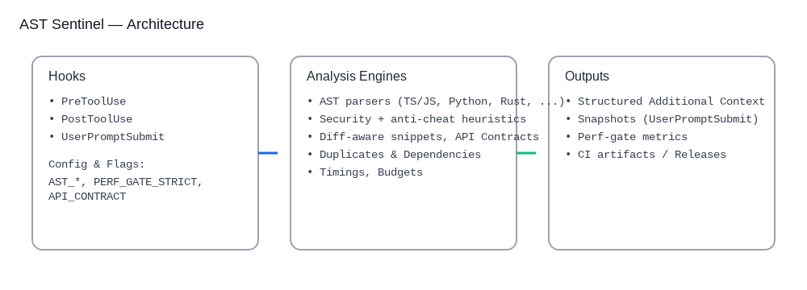

<p align="center">
  
</p>

<p align="center">
  <a href="https://github.com/iMAGRAY/ValidationCodeHook/actions" title="CI">
    
  </a>
  &nbsp;
  <a href="https://github.com/iMAGRAY/ValidationCodeHook/releases" title="Releases">
    
  </a>
  &nbsp;
  
</p>
# AST Sentinel — Hooks Reference

## Overview
AST Sentinel is a deterministic set of Claude Code hooks and multi‑language AST checks:
- PreToolUse — early validation (security, anti‑cheat, contract check)
- PostToolUse — diff, structured AST context, recommendations, timings/budgets
- UserPromptSubmit — compact project snapshot (dependencies, duplicates, quick health)

## Installation
1. Build the hooks: `cargo build --release`
2. Copy to hooks directory: binaries from `target/release` → your `hooks/`.
3. Configure Claude Code to use the hooks.

## Configuration
Prefer a single repository config file over `.env`.

- Create one of the following files in the project root (or alongside the hook binaries):
  - `.hooks-config.json` (recommended)
  - `.hooks-config.yaml` / `.hooks-config.yml`
  - `.hooks-config.toml`
  - Custom path via `HOOKS_CONFIG_FILE`

Example `.hooks-config.json`:
```
{
  "pretool_provider": "xai",
  "posttool_provider": "openai",
  "pretool_model": "grok-code-fast-1",
  "posttool_model": "gpt-4.1-mini",
  "xai_api_key": "${XAI_API_KEY}",
  "openai_api_key": "${OPENAI_API_KEY}",
  "request_timeout_secs": 60,
  "connect_timeout_secs": 30,
  "max_tokens": 4000
}
```

Notes:
- Поддерживается подстановка переменных окружения в значениях: `${VAR}` заменяется на `ENV[VAR]` (если нет — на пустую строку).
- Секреты можно хранить напрямую или подставлять из секрет‑менеджера при генерации файла.
- Если файл не найден, хуки fallback’ом используют переменные окружения/`.env` (совместимость).

### Logging
- Default logger: structured text to stderr; stdout remains reserved for hook JSON/text.
- Control level via `RUST_LOG` (e.g., `RUST_LOG=info` or `RUST_LOG=debug`).
- JSON logs for CI/production: set `LOG_JSON=1` or `HOOK_LOG_JSON=1`.
- Extra verbose paths honor `DEBUG_HOOKS=true` but still go through `tracing::debug`.

### AST Analysis Settings (policy config)
- `AST_MAX_ISSUES` (default: 100, range 10..500) — overall cap for AST issues in context (deterministic sorting: severity → line → rule_id)
- `AST_MAX_MAJOR` (optional) — cap for Major issues (defaults to `AST_MAX_ISSUES`)
- `AST_MAX_MINOR` (optional) — cap for Minor issues (defaults to `AST_MAX_ISSUES`)
- `ADDITIONAL_CONTEXT_LIMIT_CHARS` (default: 100000, range 10000..1000000) — max size of additional context; UTF‑8 safe truncation
- `AST_ANALYSIS_TIMEOUT_SECS` (default: 8, range 1..30) — per‑file AST analysis timeout to avoid stalls
- `AST_TIMINGS` (set to any value) — include a brief timings summary (p50/p95/p99/avg) at the end of AST analysis
- `FILE_READ_TIMEOUT` (seconds, default: 10) — timeout for safe file reads inside hooks

### PostToolUse: Structured Additional Context
- Deterministic section order:
  - `=== CHANGE SUMMARY ===` — unified diff of the change
  - `=== RISK REPORT ===` — Critical (all), Major (top‑N), Minor (top‑K); caps controlled by `AST_MAX_*`
  - `=== CHANGE CONTEXT ===` — code snippets with line numbers and `>` marker on the issue line
  - `=== CODE HEALTH ===` — brief readability/complexity metrics
  - `=== NEXT STEPS ===` — prioritized actions
- Prompt context (not counted into `additionalContext`):
  - Project structure + metrics (cached), dependencies report, duplicates report
  - Unified diff summary and recent transcript tail
- `ADDITIONAL_CONTEXT_LIMIT_CHARS` bounds strings with UTF‑8 safe truncation.
  - Note: `AST_MAX_ISSUES` is clamped to a minimum of 10.

### Project Context Sources
- Data included in the AI prompt alongside PostToolUse sections:
  - Project structure and metrics (with cache)
  - Dependencies analysis (npm/pip/cargo/poetry): compact summary in UserPromptSubmit; detailed in PostToolUse
  - Duplicate/conflict report (DuplicateDetector) — critical signals
- These do not increase `additionalContext` (except in offline AST modes), keeping output compact.
  - See `docs/PLAYBOOK_AST_FLAGS.md` for quick scenarios.

#### Duplicate Report Caps
- `DUP_REPORT_MAX_GROUPS` (default: 20, range 1..200) — max number of duplicate groups
- `DUP_REPORT_MAX_FILES` (default: 10, range 1..200) — max files listed per group; remaining files are summarized as “... and N more files hidden by limit”

#### JS/TS: Signatures and Entity Names
- Recognizes functions and methods in JS/TS, including function declarations, class methods, arrow and `function` expressions, and class fields
- Methods in object literals supported both as `foo: ()=>{}` / `foo: function(){}` and shorthand `foo(){}`
- Computed names (`[computed]`) clarified when possible via tree‑sitter (e.g., `[Symbol.iterator]` → `[computed: Symbol.iterator]`, `['name']` → `[computed: name]`)
- Parameters extracted with support for optional/default/rest/destructuring; TS `this` is ignored

### Builds & Artifacts
- Release artifacts and checksums are placed in `dist/`:
  - `dist/linux-x86_64/{pretooluse,posttooluse,userpromptsubmit}` + `SHA256SUMS.txt`
  - `dist/windows-x86_64/{pretooluse.exe,posttooluse.exe,userpromptsubmit.exe}` + `SHA256SUMS.txt`
- Verify integrity via `sha256sum -c SHA256SUMS.txt` inside the corresponding folder.

### Quick Start (Linux)
```
cp dist/linux-x86_64/posttooluse hooks/
cp dist/linux-x86_64/pretooluse hooks/
cp dist/linux-x86_64/userpromptsubmit hooks/
```

### Quick Start (Windows)
```
copy dist\windows-x86_64\posttooluse.exe hooks\
copy dist\windows-x86_64\pretooluse.exe hooks\
copy dist\windows-x86_64\userpromptsubmit.exe hooks\
```

### AST Timings (Observability)
- `AST_TIMINGS` (set to any value) — collect and print timing stats at the end of additionalContext:
  - Format: `=== TIMINGS (ms) ===` with per‑label metrics: count, p50, p95, p99, avg
  - Labels: `parse/<lang>` (tree‑sitter parsing/metrics), `score/<lang>` (AST scoring)
  - Useful for offline diagnostics and performance control

### Soft Time Budget (I2)
- `AST_SOFT_BUDGET_BYTES` (default: 500000, clamp 1..5000000) — soft limit by file size; when exceeded, AST analysis is skipped with a note
- `AST_SOFT_BUDGET_LINES` (default: 10000, clamp 1..200000) — soft limit by line count
- Skip note is uniform across AST_ONLY, DRY_RUN, and online flows: `[ANALYSIS] Skipped AST analysis due to soft budget (… )`
- Diff analysis/formatting/other context remains available

See `docs/PLAYBOOK_AST_FLAGS.md` for before/after examples and quick commands.

### Diagrams

<p>
  
</p>

<p>
  
</p>

## Flag Reference

- Core limits:
  - `ADDITIONAL_CONTEXT_LIMIT_CHARS` (default 100000, 10000..1000000) — cap for additionalContext (UTF‑8 safe)
  - `USERPROMPT_CONTEXT_LIMIT` (default 4000, 1000..8000) — cap for UserPromptSubmit output
- AST:
  - `AST_MAX_ISSUES`, `AST_MAX_MAJOR`, `AST_MAX_MINOR` — caps for number of issues (overall/by severity)
  - `AST_ANALYSIS_TIMEOUT_SECS` (1..30, default 8) — per‑file analysis timeout
  - `AST_SOFT_BUDGET_BYTES` (1..5_000_000, default 500000), `AST_SOFT_BUDGET_LINES` (1..200_000, default 10000) — soft budgets; skipped with a note when exceeded
  - `AST_TIMINGS` — add timings section (AST_ONLY; p50/p95/p99/avg)
- Diff/Context:
  - `AST_DIFF_ONLY=1` — filter issues to changed lines
  - `AST_DIFF_CONTEXT` (default 3) — context lines around changes
  - `AST_SNIPPETS` (default 1) — enable/disable CHANGE CONTEXT section
  - `AST_ENTITY_SNIPPETS` (default 1) — entity‑based snippets (function/method/class)
  - `AST_MAX_SNIPPETS` (default 3, 1..50), `AST_SNIPPETS_MAX_CHARS` (default 1500, 200..20000)
- PostToolUse UX:
  - `QUICK_TIPS` (default 1), `QUICK_TIPS_MAX`, `QUICK_TIPS_MAX_CHARS`
  - `API_CONTRACT` (default 1) — enable API CONTRACT section (AST_ONLY/DRY_RUN/online)
- Duplicates:
  - `DUP_REPORT_MAX_GROUPS` (default 20), `DUP_REPORT_MAX_FILES` (default 10)
  - `DUP_REPORT_TOP_DIRS` (default 3, 0..20) — “Top directories” summary
- Perf gate:
  - `PERF_GATE_STRICT` — strict mode in CI (`.github/workflows/perf-gate.yml`)

## Windows Quick Start

1) Build release: `cargo build --release`
2) Run hooks directly:
   - PostToolUse (AST_ONLY):
     - `set POSTTOOL_AST_ONLY=1`
     - `set QUICK_TIPS=1`
     - `set AST_TIMINGS=1`
     - `set API_CONTRACT=1`
     - `target\release\posttooluse.exe < hook.json`
   - UserPromptSubmit:
     - `set USERPROMPT_CONTEXT_LIMIT=1200`
     - `target\release\userpromptsubmit.exe < hook_userprompt.json`
3) Duplicate report caps:
   - `set DUP_REPORT_MAX_GROUPS=10`
   - `set DUP_REPORT_MAX_FILES=5`
   - `set DUP_REPORT_TOP_DIRS=3`

### Sections vs. Flags

| Section         | Produced in                  | Controlled by                          |
|-----------------|------------------------------|----------------------------------------|
| CHANGE SUMMARY  | PostToolUse (all modes)      | —                                      |
| RISK REPORT     | PostToolUse (all modes)      | `AST_MAX_*`, `AST_DIFF_*`              |
| QUICK TIPS      | PostToolUse (AST_ONLY/online)| `QUICK_TIPS*`                           |
| CHANGE CONTEXT  | PostToolUse (all modes)      | `AST_SNIPPETS*`, `AST_ENTITY_SNIPPETS` |
| CODE HEALTH     | PostToolUse (all modes)      | —                                      |
| API CONTRACT    | PostToolUse (all modes)      | `API_CONTRACT`                          |
| NEXT STEPS      | PostToolUse (all modes)      | —                                      |
| TIMINGS         | PostToolUse (AST_ONLY)       | `AST_TIMINGS`                           |

### Duplicate Conflicts → Actions (cheat sheet)

| Conflict Type   | Meaning                                        | Recommended Action                   |
|-----------------|------------------------------------------------|--------------------------------------|
| ExactDuplicate  | Same content in multiple files                 | Keep newest/largest; remove others   |
| VersionConflict | Variants like `_new`, `_old`, `copy`, `v2`     | Consolidate into a single canonical  |
| BackupFile      | `.bak`, `.old`, `.backup`, trailing `~`        | Remove backup files                  |
| TempFile        | `.tmp`, `.temp`, `.swp`                        | Remove temp files                    |
| SimilarName     | Similar stems in same directory (likely drift) | Review and consolidate if needed     |
