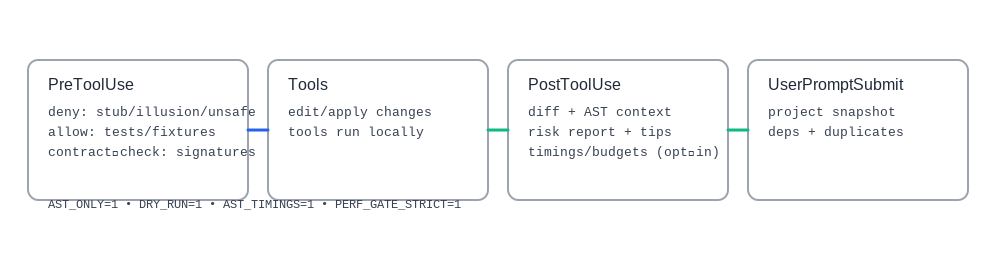

  

# Architecture Overview

AST Sentinel is a deterministic, multi‑language AST analysis toolkit packaged as Claude Code hooks. It focuses on stable outputs, compact structured context, and strict performance/observability controls.

  

## Modules
- `src/analysis`: AST, metrics, duplicates, dependency parsing, project scan
  - `ast/`: multi‑language AST via tree‑sitter; Rust uses `syn`
  - `metrics/`: complexity metrics structures
  - `duplicate_detector.rs`: content‑hash and name‑based grouping with caps
  - `dependencies.rs`: npm/pip/cargo/poetry parsers
  - `project.rs`: project‑wide scan orchestration
- `src/formatting`: multi‑language formatters + formatting service
- `src/providers`: AI abstraction (`UniversalAIClient`, optional online)
- `src/cache`: lightweight project cache
- `src/validation`: diff formatter and miscellaneous checks
- `src/bin`: hook binaries (`pretooluse`, `posttooluse`, `userpromptsubmit`)

## Key Flows
- PreToolUse — lightweight AST/security checks to allow/ask/deny risky operations (offline via `PRETOOL_AST_ONLY`).
- PostToolUse — deterministic additionalContext (change summary, risk report, change context, code health, API contract, next steps) plus prompt‑side project context.
- UserPromptSubmit — compact project snapshot (structure/health, dependencies, duplicates).

## AST Scoring & Engines
- Rust: `syn` visitor; rules include unreachable after `return/continue/break`, deep nesting, parameter limits, long lines, credentials/SQL.
- JS/TS, Python, others: tree‑sitter.
- Fast path: `ast_fastpath` feature consolidates core rules into a single pass for speed while preserving determinism.

## Determinism & Limits
- Stable sorting: `severity → line → rule_id`.
- Caps: `AST_MAX_ISSUES`, `AST_MAX_MAJOR`, `AST_MAX_MINOR`, `ADDITIONAL_CONTEXT_LIMIT_CHARS` (UTF‑8‑safe truncation).
- Timeouts: `AST_ANALYSIS_TIMEOUT_SECS` per file; safe file I/O via `FILE_READ_TIMEOUT`.

  

